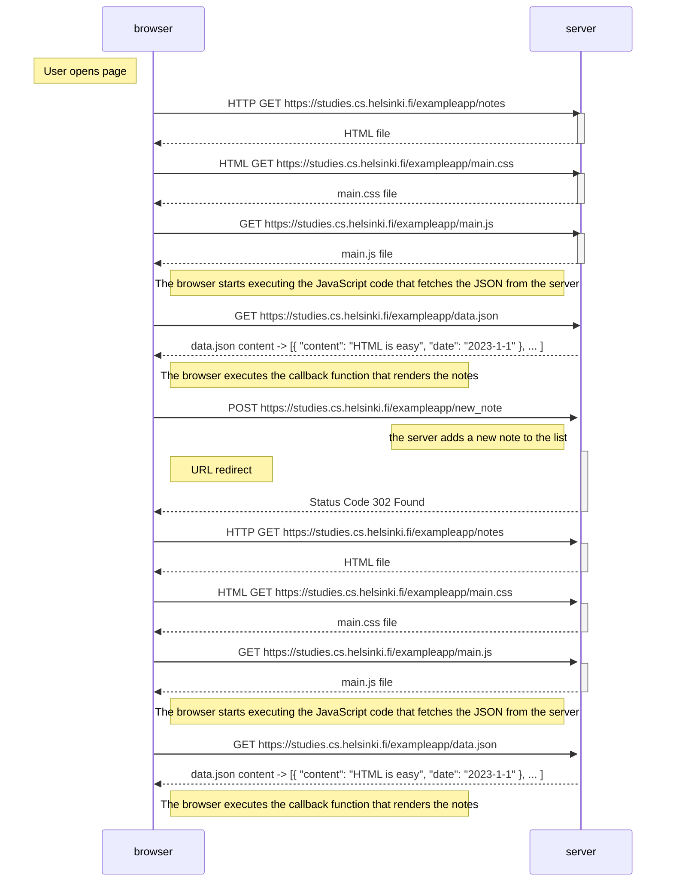

```mermaid
    sequenceDiagram
        participant browser
        participant server

        Note left of browser: User opens page
        browser->>server: HTTP GET https://studies.cs.helsinki.fi/exampleapp/notes
        activate server
        server-->>browser: HTML file
        deactivate server

        browser->>server: HTML GET https://studies.cs.helsinki.fi/exampleapp/main.css
        activate server
        server-->>browser: main.css file
        deactivate server

        browser->>server: GET https://studies.cs.helsinki.fi/exampleapp/main.js
        activate server
        server-->>browser: main.js file
        deactivate server

        Note right of browser: The browser starts executing the JavaScript code that fetches the JSON from the server

        browser->>server: GET https://studies.cs.helsinki.fi/exampleapp/data.json
        activate server
        server-->>browser: data.json content -> [{ "content": "HTML is easy", "date": "2023-1-1" }, ... ]
        Note right of browser: The browser executes the callback function that renders the notes

        browser->>server: POST https://studies.cs.helsinki.fi/exampleapp/new_note
        Note left of server: the server adds a new note to the list
        activate server
        Note right of browser: URL redirect
        server-->>browser: Status Code 302 Found
        deactivate server

        browser->>server: HTTP GET https://studies.cs.helsinki.fi/exampleapp/notes
        activate server
        server-->>browser: HTML file
        deactivate server

        browser->>server: HTML GET https://studies.cs.helsinki.fi/exampleapp/main.css
        activate server
        server-->>browser: main.css file
        deactivate server

        browser->>server: GET https://studies.cs.helsinki.fi/exampleapp/main.js
        activate server
        server-->>browser: main.js file
        deactivate server

        Note right of browser: The browser starts executing the JavaScript code that fetches the JSON from the server

        browser->>server: GET https://studies.cs.helsinki.fi/exampleapp/data.json
        activate server
        server-->>browser: data.json content -> [{ "content": "HTML is easy", "date": "2023-1-1" }, ... ]
        Note right of browser: The browser executes the callback function that renders the notes


```