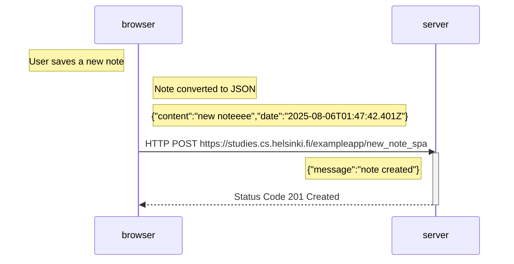

```mermaid
    sequenceDiagram
        participant browser
        participant server

        Note left of browser: User saves a new note
        Note right of browser: Note converted to JSON
        Note right of browser: {"content":"new noteeee","date":"2025-08-06T01:47:42.401Z"}
        browser->>server: HTTP POST https://studies.cs.helsinki.fi/exampleapp/new_note_spa
        activate server
        Note left of server: {"message":"note created"}
        server-->>browser: Status Code 201 Created

        deactivate server
```